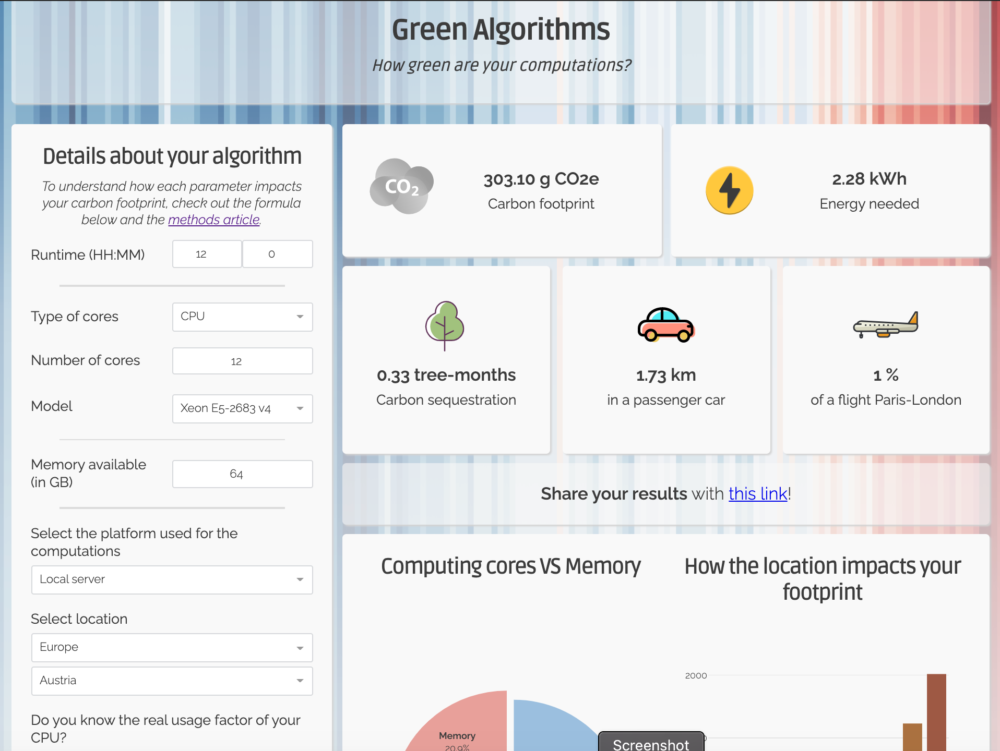

% No Computing on a Dead Planet
% Chris Edsall - @hpcchris
% SeptemberRSE 2021

------------------


::: notes

This is the small town of Lytton in British Columbia, Canada in June this year
and the temperature is in Celcius. This is not a desert in the Middle East or
Death Valley, Nevada, but in Canada.

:::

------------------


::: notes

It didn't have just one very hot day, it had a run of them as part of the 2021 North
American heatwave.

:::

------------------


::: notes

The result was after being baked for days on end there was a wildfire that, as
you can see in the picture on the right, raized the village to the ground, 90%
of the buildings were destroyed and two people died. 

:::


------------------


::: notes

While it is very difficult to attribute a single event to global climate change
this is just many in an increasing series of extreme weather events. The
heatwave would have been 150 times less likely in the absence of climate
change.

Earlier this year IPCC 6th Assessment Report

UN secretry general "code Red for humanity"

:::


------------------

{ width=75% }

------------------

Computing -> energy use -> carbon emissions

::: notes

- embodied carbon from manufacture
- energy use over lifetime from operations
- energy not 100% linked to emissions - depends on intnesity

:::

------------------

## Outline

- Who is this talk for?
- High level awareness 
- Carbon Intensity
- Reduce / reuse / recycle
- Reduced precision
- Measure
- Energy in more detail
- Profilers
- Languages
- Non-CPU hardware
- Advice

------------------

## Who is this talk for?

RSEs who write

 - libraries used by thousands
 - software for HPC


::: notes

It's the large agregate use that matters. One research group running a small script 10 times isn't going to make a dent.

:::
------------------

## Energy Efficient Computing Pipeline

- Component manufacturers 
- System vendors
- Power compainies
- Facilities managers / Datacentre operators / Cloud providers 
- Sysadmins

::: notes

- Silicon manufactures use processs and architecure advances to make more efficient processors, gpus and ram
- Server manufactures optimse the components and cooling
- Power companies use a mix of generation methods
- FAcilities managers chose the power distribution, cooling and other data centre parameters
- Sysadmins and operators can tweak settings in the UEFI/Bios and operating system
- ALL of this is covered elsewhere, but what can we do

:::

------------------

## High Level 

- Christopher Woods - [https://chryswoods.github.io/howmuchisenough/](https://chryswoods.github.io/howmuchisenough/)
- Green algorithms - [https://www.green-algorithms.org/](https://www.green-algorithms.org/)

::: notes

The first thing is to be aware and mindful of our energy use

These two sites can help

:::

------------------

{ width=60% }

------------------



------------------

## Carbon Intensity


::: notes

- One thing to note is that not all power generation is equally damagaing to the environment
- carbon intnesity

:::

------------------

## Carbon Intensity

Varies by time


::: notes

If you can choose when to run your workload you can avoid periods of high carbon intensity

:::

------------------

## Carbon Intensity

And varies by space

{ width=65% }

::: notes

choice of where to run, e.g. JISC DCs in Slough vs Leeds

:::
------------------

## Carbon Intensity

API docs at [https://carbon-intensity.github.io/api-definitions/](https://carbon-intensity.github.io/api-definitions/)

```json
curl -X GET https://api.carbonintensity.org.uk/intensity \
  -H 'Accept: application/json'
{ 
  "data":[{ 
    "from": "2021-09-21T05:30Z",
    "to": "2021-09-21T06:00Z",
    "intensity": {
      "forecast": 253,
      "actual": 257,
      "index": "moderate"
    }
  }]
}
```

------------------

## Cloud locations


------------------

## Reduce, Reuse, Recycle

{ width=50% }

::: notes

- Reduce: think about your computing campaign, e.g. don't parameter sweep of a grid, but use guided optimsation
- Reuse: JASMIN has a huge collection of climate data
- use data generated from one experiment for a diffeerent purpose

:::

------------------

> The fastest code is the code which does not run. The code easiest to maintain
> is the code that was never written.
>
> -- Robert Galanakis 

::: notes

This applies to micro optimisations in the code as well as at the macro level of running a computing campaign or not

:::
------------------

## Reduced Precision

```diff
--- tmp.cpp	2021-09-20 21:12:47.000000000 +0100
+++ tmp-smaller.cpp	2021-09-20 21:13:12.000000000 +0100
@@ -1 +1 @@
-std::vector<double> data;
+std::vector<float> data;
```

- [HPL-AI](https://hpl-ai.org/) - get 10x speedup
- DL datatypes: bfloat16, int8 

::: notes

- payoff in increased cache utilisation, reduced data movement to main RAM, reduced network data movement

:::

------------------

>  I think that it's really important in
> any design considerations whether it's
> engineering or science that we are able
> as much as possible to measure what
> we're trying to improve and I think that
> we need to start doing that more
> rigorously for energy efficiency we've
> been doing it for performance for years
>
> -- Natalie Bates 2012 [Energy Efficient HPC WG](https://eehpcwg.llnl.gov/)


------------------

## Energy = Power * Time


::: notes

plot of constant power is a rectangle

for varying power we need to integrate the area under the curve

:::

------------------


::: notes

- flowchart from John C Linford of Arm who has a good video on youtube

:::

------------------

## Intel vTune

```bash
socwatch -t 60 -f cpu-cstate -m -o results/test -r vtune
```


------------------

## nvprof / nvvp

```bash
nvprof --system-profiling on # default is off
```


------------------

## Cray PAT

```bash
pat_report -v -O program_energy
```

------------------

"The ecological impact of high-performance computing in astrophysics"

[DOI:10.1038/s41550-020-1208-y](https://doi.org/10.1038/s41550-020-1208-y)

{ width=60% }

::: notes

- generated a lot of noise at the time
- conclusino "maybe don't teach python" wrong one
- through profiling knwo when to call in to othe languages/libraries
- personal opinion that teaching novices c++ is not the way to go

:::

------------------

"Energy efficiency across programming languages: how do energy, time, and memory relate?"

[DOI:10.1145/3136014.3136031](https://dl.acm.org/doi/10.1145/3136014.3136031)


::: notes

- 2017 paper Pereira et al
- used the computer language benchmark game
- conclusion: it's complicated

:::

------------------

## Non-CPU Hardware

- CPUs
    - Arm
    - Risc-V

- GPUs
    - Nvidia
    - AMD
    - Intel

- FPGAs

::: notes

- research code lasts longer than systems
- CPUs different ISAs
- trend for more specialised hardware
- Performance portabilith OpenMP / SYCL

:::

------------------

## Advice

- Avoid unneeded computations
- Measure, profile
- Investigate reduced precision
- Write with portability in mind
- For operations, prefer when and where depending on CO<sub>2</sub> intensity
- Don't implement proof of work based blockchains
